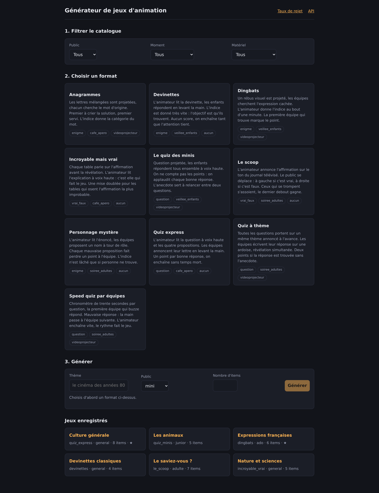
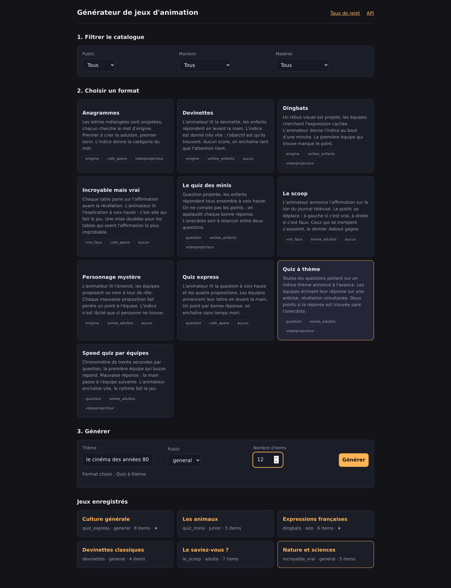
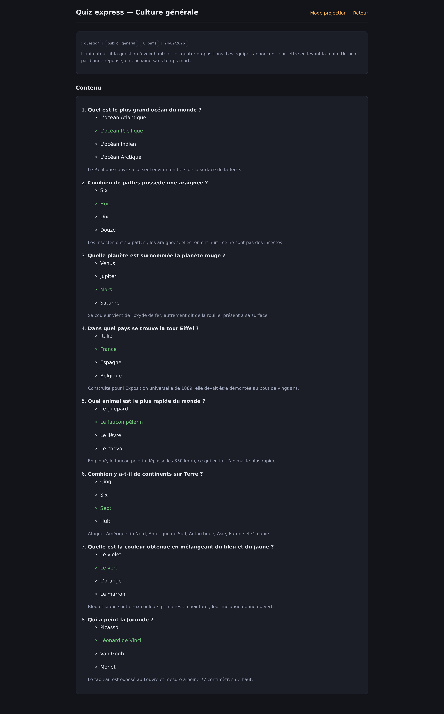
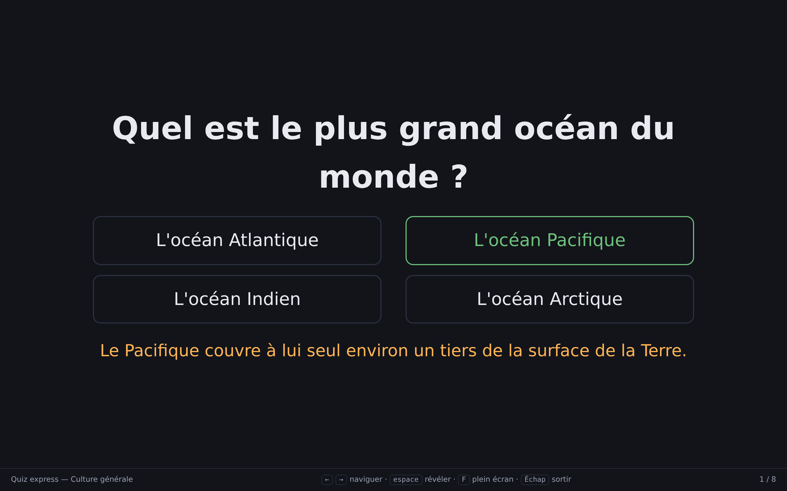
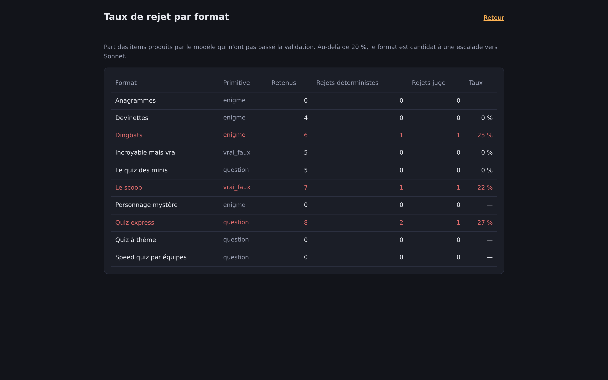
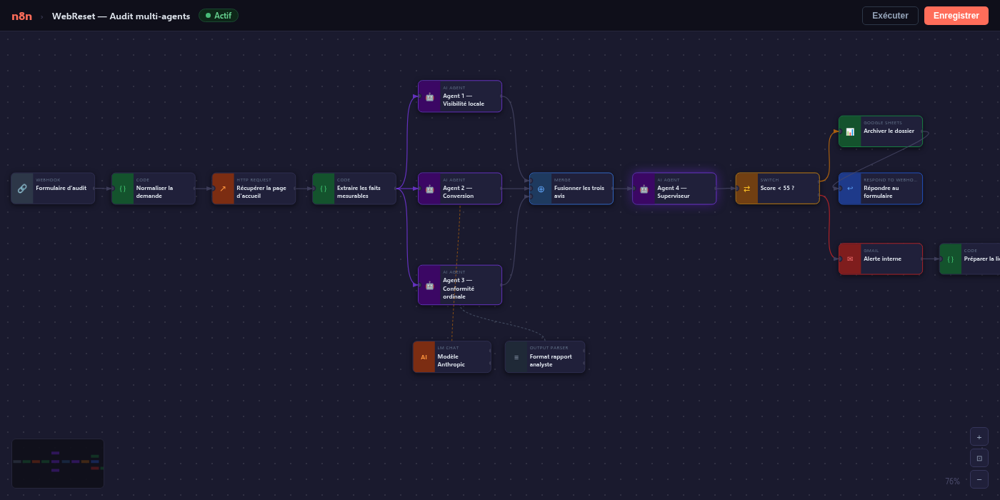

# Dossier Arthur Parois — candidature alternance

Site statique qui regroupe mes travaux en quatre planches : parcours et CV,
sites web, n8n, et une démonstration de workflow multi-agents.

Aucune dépendance, aucune étape de build : ouvrez `index.html`, ou servez le
dossier tel quel (GitHub Pages, Netlify, n'importe quel hébergeur statique).

---

## Le générateur de jeux d'animation

L'application centrale de ce dossier : un générateur de contenu validé pour animateurs socioculturels.

### Interface principale — catalogue de formats



Dix formats couverts par trois primitives de génération (`question`, `enigme`, `vrai_faux`). Filtrage par public, moment, matériel.

### Formulaire de génération



L'animateur choisit un format, saisit un thème et un public. Le modèle génère le contenu, un juge LLM valide la cohérence avant tout enregistrement.

### Résultats générés et validés



### Mode projection plein écran



Conçu pour être projeté devant le groupe. Les équipes répondent, l'animateur révèle au clic.

### Métriques de validation



Le juge LLM rejette silencieusement les items incohérents. Le tableau de bord expose le taux de rejet par format — levier principal du coût d'API.

---

## Le workflow n8n — audit multi-agents

`assets/n8n/webreset-audit-agents.json` s'importe dans un canevas n8n vide.



**Chaîne complète :**
webhook → normalisation → récupération de la page → extraction de 18 signaux mesurables → **trois agents spécialisés en parallèle** (visibilité, conversion, conformité) → fusion → agent superviseur → aiguillage sur le score → alerte Gmail + archivage Google Sheets → réponse.

Il attend trois identifiants : un modèle de chat (Anthropic Claude), un compte Gmail pour l'alerte interne, une base Postgres pour l'archivage.

---

## Structure du dossier

```
index.html                              les quatre planches (onglets côté client)
cv.html                                 le CV seul, mis en page pour l'impression A4
assets/cv/arthur-parois-cv.pdf          le même CV en PDF, texte sélectionnable
scripts/generer-cv-pdf.sh               refabrique ce PDF à partir de cv.html
assets/css/dossier.css                  feuille de style unique, thèmes clair et sombre
assets/js/dossier.js                    onglets, thème, chargement différé des pièces jointes
assets/js/audit-agents.js              rejeu du workflow d'agents + les trois dossiers figés
assets/n8n/webreset-audit-agents.json  le workflow n8n, importable tel quel (18 nœuds)
assets/img/animation/                   captures de l'application de jeux d'animation
demos/n8n-fonctions.html               cours interactif « Les fonctions n8n, en pratique »
```

## Publier sur GitHub Pages

Réglages du dépôt → Pages → *Deploy from a branch* → branche courante, dossier `/`.

## Les deux sites clients

`projets/kine` et `projets/webreset` contiennent les applications Next.js,
préparées pour l'export statique et prêtes à être publiées sur GitHub Pages.

```bash
./scripts/publier-les-sites.sh
```

- https://arthurparoisgithu.github.io/kin-/
- https://arthurparoisgithu.github.io/web-rest/

## Publier le dossier lui-même

Adresse une fois rendu public + Pages activé :
https://arthurparoisgithu.github.io/newnew/
