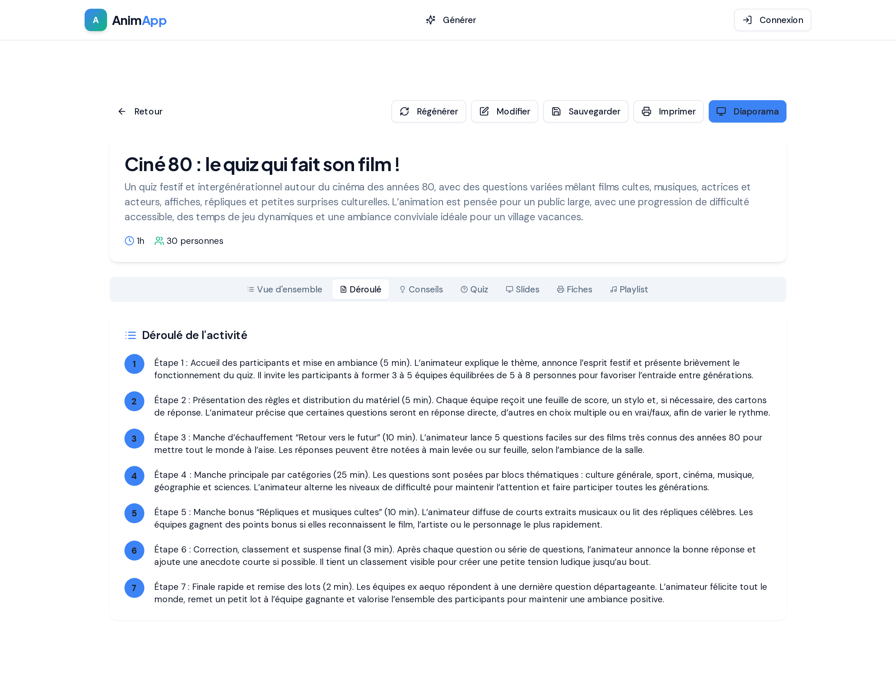
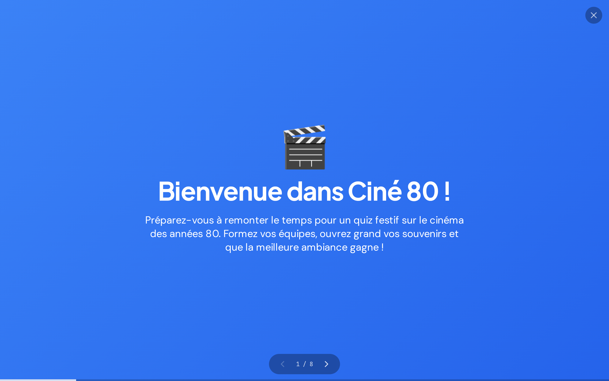

# Dossier Arthur Parois — candidature alternance

Site statique qui regroupe mes travaux en quatre planches : parcours et CV,
sites web, n8n, et une démonstration de workflow multi-agents.

Aucune dépendance, aucune étape de build : ouvrez `index.html`, ou servez le
dossier tel quel (GitHub Pages, Netlify, n'importe quel hébergeur statique).

---

## AnimApp — le générateur d'activités d'animation

L'application centrale de ce dossier : **AnimApp**, un générateur d'activités
clé en main pour animateurs. Vous choisissez une catégorie, réglez quelques
paramètres, et l'IA produit une activité complète — déroulé minuté, slides,
fiches imprimables et diaporama de projection.

### Page d'accueil — le catalogue de catégories


Sept catégories couvrent tous les moments d'un séjour : **Grands Jeux du Soir**,
**Instants Apéro**, **Quiz**, **Dingbats**, **Concours**, **Escape Game** et
**Karaoké**. Chaque carte mène directement à son formulaire de configuration.

### Configuration de l'activité


L'animateur saisit un thème (ici « Le cinéma des années 80 ») puis règle l'âge
du public, le nombre de participants, la durée, le niveau de difficulté et
l'ambiance recherchée. Un clic sur **Générer l'activité** lance la production
par l'IA.

### Le résultat généré — vue d'ensemble


L'activité arrive complète et prête à animer : titre accrocheur, résumé,
matériel nécessaire et règles du jeu. Une barre d'onglets donne accès à toutes
les facettes (Vue d'ensemble, Déroulé, Conseils, Quiz, Slides, Fiches,
Playlist), et les boutons **Régénérer**, **Modifier**, **Sauvegarder**,
**Imprimer** et **Diaporama** pilotent la suite.

### Le déroulé minuté, étape par étape



Le cœur opérationnel pour l'animateur : chaque étape est numérotée, minutée et
décrite précisément (accueil, présentation des règles, manches successives,
correction, finale et remise des lots). Tout est prêt à être suivi le jour J.

### Le mode diaporama, pour projeter devant le groupe



Un mode plein écran génère automatiquement un diaporama d'animation (ici 8
slides) : écran de bienvenue, consignes et questions défilent proprement, prêts
à être projetés devant les participants.

---

## Le workflow n8n — audit multi-agents

`assets/n8n/webreset-audit-agents.json` s'importe dans un canevas n8n vide.


**Chaîne complète :**
webhook → normalisation → récupération de la page → extraction de 18 signaux mesurables → **trois agents spécialisés en parallèle** (visibilité, conversion, conformité) → fusion → agent superviseur → aiguillage sur le score → alerte Gmail + archivage Google Sheets → réponse.

Il attend trois identifiants : un modèle de chat (Anthropic Claude), un compte Gmail pour l'alerte interne, une base Postgres pour l'archivage.

---

## Structure du dossier

```
index.html                              les quatre planches (onglets côté client)
cv.html                                 le CV seul, mis en page pour l'impression A4
assets/cv/arthur-parois-cv.pdf          le même CV en PDF, texte sélectionnable
scripts/generer-cv-pdf.sh               refabrique ce PDF à partir de cv.html
assets/css/dossier.css                  feuille de style unique, thèmes clair et sombre
assets/js/dossier.js                    onglets, thème, chargement différé des pièces jointes
assets/js/audit-agents.js              rejeu du workflow d'agents + les trois dossiers figés
assets/n8n/webreset-audit-agents.json  le workflow n8n, importable tel quel (18 nœuds)
assets/img/animation/                   captures d'écran d'AnimApp et du workflow n8n
demos/n8n-fonctions.html               cours interactif « Les fonctions n8n, en pratique »
```

## Publier sur GitHub Pages

Réglages du dépôt → Pages → *Deploy from a branch* → branche courante, dossier `/`.

## Les deux sites clients

`projets/kine` et `projets/webreset` contiennent les applications Next.js,
préparées pour l'export statique et prêtes à être publiées sur GitHub Pages.

```bash
./scripts/publier-les-sites.sh
```

- https://arthurparoisgithu.github.io/kin-/
- https://arthurparoisgithu.github.io/web-rest/

## Publier le dossier lui-même

Adresse une fois rendu public + Pages activé :
https://arthurparoisgithu.github.io/newnew/
